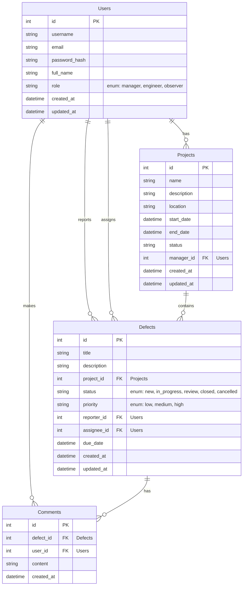

# 🏗️ «СистемаКонтроля» для строительных объектов


Монолитное веб-приложение для централизованного управления дефектами на строительных объектах. Система обеспечивает полный цикл работы: от регистрации дефекта и назначения исполнителя до контроля статусов и формирования отчётности.

## 📋 Назначение системы

```mermaid
    usecaseDiagram
    actor Инженер
    actor Менеджер
    actor Наблюдатель as "Руководитель и заказчик"

    rectangle "СистемаКонтроля" {
        Инженер -- (Регистрация дефектов)
        Инженер -- (Обновление информации о дефектах)
        Менеджер -- (Назначение задач)
        Менеджер -- (Контроль сроков)
        Менеджер -- (Формирование отчётов)
        Менеджер -- (Управление пользователями)
        Менеджер -- (Управление проектами)
        Наблюдатель -- (Просмотр прогресса)
        Наблюдатель -- (Просмотр отчётности)
        (Регистрация пользователей и аутентификация) <--- (Инженер, Менеджер, Наблюдатель)
        (Разграничение прав доступа) <--- (Инженер, Менеджер, Наблюдатель)
        (Поиск, сортировка и фильтрация дефектов) <--- (Инженер, Менеджер, Наблюдатель)
        (Экспорт отчётности в CSV/Excel) <--- (Менеджер, Наблюдатель)
        (Просмотр аналитических отчётов) <--- (Менеджер, Наблюдатель)
        (Ведение комментариев и истории изменений) <--- (Инженер, Менеджер, Наблюдатель)
        (Управление статусами дефектов) <--- (Инженер, Менеджер)
    }
```
Система предназначена для:
* **Инженеров** — регистрация дефектов, обновление информации
* **Менеджеров** — назначение задач, контроль сроков, формирование отчётов, управление пользователями
* **Руководителей и заказчиков** — просмотр прогресса и отчётности

## ⚙️ Функциональные возможности

- ✅ Регистрация пользователей и аутентификация
- 👥 Разграничение прав доступа (менеджер, инженер, наблюдатель)
- 👤 Управление пользователями и их ролями (только для менеджеров)
- 🏢 Управление проектами/объектами и их этапами
- 🔍 Создание и редактирование дефектов (заголовок, описание, приоритет, исполнитель, сроки, вложения)
- 📊 Управление статусами дефектов: Новая → В работе → На проверке → Закрыта/Отменена
- 💬 Ведение комментариев и истории изменений
- 🔎 Поиск, сортировка и фильтрация дефектов
- 📈 Экспорт отчётности в CSV/Excel
- 📊 Просмотр аналитических отчётов (графики, статистика)
- 🧾 Общий отчет (проекты + дефекты)
- 👁️ Доступ к разделу «Отчеты» имеют роли: менеджер и наблюдатель

## 🧰 Технологический стек

### Backend
- **Golang** с **Gin Framework** — основа серверной части
- **PostgreSQL** — реляционная СУБД
- **GORM** — ORM для работы с базой данных
- **JWT** — токены для авторизации
- **Docker** — контейнеризация

### Frontend
- **Vue.js** — основной фреймворк
- **TypeScript** — типизация JavaScript
- **Vite** — быстрая сборка
- **Vue Router** — маршрутизация
- **Chart.js** — визуализация данных

### Тестирование
- **Playwright** — e2e тестирование
- **Vitest** — unit-тестирование

## 🗄️ Структура базы данных



### Таблица Users
- id (PK)
- username
- email
- password_hash
- full_name
- role (enum: manager, engineer, observer)
- created_at
- updated_at

### Таблица Projects
- id (PK)
- name
- description
- location
- start_date
- end_date
- status
- manager_id (FK -> Users)
- created_at
- updated_at

### Таблица Defects
- id (PK)
- title
- description
- project_id (FK -> Projects)
- status (enum: new, in_progress, review, closed, cancelled)
- priority (enum: low, medium, high)
- reporter_id (FK -> Users)
- assignee_id (FK -> Users)
- due_date
- created_at
- updated_at

### Таблица Comments
- id (PK)
- defect_id (FK -> Defects)
- user_id (FK -> Users)
- content
- created_at

## 📋 Система миграций

Проект использует собственную систему миграций для управления схемой базы данных, которая позволяет:
- Автоматизировать создание/обновление структуры базы данных
- Отслеживать изменения в схеме базы данных через Git
- Обеспечить целостность данных при обновлении схемы
- При необходимости откатить последние изменения

### Компоненты системы миграций

- **migration.go** — базовый механизм для применения/отмены миграций
- **001_create_users.go, 002_create_projects.go** и т.д. — отдельные файлы миграций
- **runner.go** — список всех миграций и функции для их запуска

### Существующие миграции

1. **001_create_users.go** — создание таблицы пользователей
2. **002_create_projects.go** — создание таблицы проектов
3. **003_create_defects.go** — создание таблицы дефектов
4. **004_create_comments.go** — создание таблицы комментариев
5. **005_add_indices.go** — добавление индексов для оптимизации запросов

### Работа с миграциями

Запуск миграций:
```bash
cd backend
make migrate
# или
go run cmd/migrate/main.go
```

Отмена последней миграции:
```bash
cd backend
make rollback
# или
go run cmd/migrate/main.go --rollback
```

## 🔒 Безопасность

- JWT токены для авторизации
- Хеширование паролей через bcrypt
- RBAC (Role-Based Access Control)
- Защита от SQL-инъекций (параметризованные запросы)
- Защита от XSS (санитация входных данных)
- Валидация всех входящих данных
- Отладочные функции с доступом только для разработчиков

## 🐳 Запуск через Docker

### 1. Подготовка окружения

- **Windows**
  - Установите Docker Desktop и включите режим Linux containers (WSL2 Integration — желательно).
  - Создайте `.env` из примера:
    - PowerShell:
      ```powershell
      Copy-Item -Path ".env.example" -Destination ".env" -Force
      ```
    - CMD:
      ```cmd
      copy /Y .env.example .env
      ```

- **Linux/macOS**
  - Установите Docker Engine и плагин Compose.
  - Создайте `.env` из примера:
    ```bash
    cp .env.example .env
    ```

Откройте `.env` и при необходимости измените параметры (порты и данные БД). Значение `DB_PASSWORD` используется как пароль пользователя `POSTGRES_USER` в контейнере PostgreSQL.

### 2. Сборка и запуск контейнеров

- **Windows (PowerShell/CMD)**
  ```powershell
  docker compose up -d --build
  ```
- **Linux/macOS**
  ```bash
  # при необходимости добавьте sudo (если пользователь не в группе docker)
  docker compose up -d --build
  # или
  sudo docker compose up -d --build
  ```

Адреса по умолчанию:
- Backend API: http://localhost:${SERVER_PORT:-8080} (по умолчанию 8080)
- Frontend: http://localhost:${FRONTEND_PORT:-5173} (по умолчанию 5173)

### 3. Миграции базы данных

Миграции применяются автоматически при запуске `backend` (в `docker-compose.yml` используется команда `/app/migrate && /app/server`).

Ручной запуск/откат при необходимости:

```bash
docker compose exec backend /app/migrate
docker compose exec backend /app/migrate --rollback
```

### 4. Полезные команды

- **Windows**
  ```powershell
  docker compose ps
  docker compose logs -f backend
  docker compose logs -f frontend
  docker compose logs -f db
  docker compose down
  docker compose down -v   # очистить volume БД
  ```

- **Linux/macOS**
  ```bash
  docker compose ps
  docker compose logs -f backend
  docker compose logs -f frontend
  docker compose logs -f db
  docker compose down
  docker compose down -v   # очистить volume БД
  # при необходимости используйте sudo
  # sudo docker compose ...
  ```

### 5. Траблшутинг и заметки

- **Windows**
  - Убедитесь, что Docker Desktop запущен и выбран режим Linux containers.
  - Включите WSL2 Integration (Settings → Resources → WSL Integration).
  - Предупреждение compose про `version` можно игнорировать или удалить строку `version: "3.9"`.
- **Linux/macOS**
  - Если требуется `sudo` для docker-команд, можно добавить пользователя в группу docker:
    ```bash
    sudo usermod -aG docker $USER
    # выйдите и войдите в систему заново, затем проверьте
    docker ps
    ```
  - Предупреждение compose про `version` можно игнорировать или удалить строку `version: "3.9"`.

## 🚀 Запуск проекта без использования Docker

Для запуска проекта вам потребуется установить Go и Node.js на вашей системе.

### 1. Клонирование репозитория

```bash
git clone https://github.com/Sopirm/systemControl_proj
cd systemControl_proj
```

### 2. Запуск Backend (GoLang Gin)

**2.1 Создание базы данных PostgreSQL**

Перед запуском сервера и применением миграций необходимо создать базу данных `systemcontrol` в PostgreSQL. Вы можете сделать это одним из следующих способов:

**С помощью `psql`
